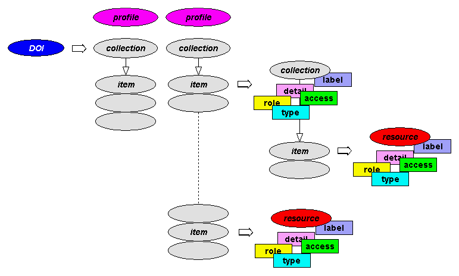

# YADS – A Description Service

YADS was a data model for describing annotated hierarchical resource bundles in a generic way which could be mapped to other models and serializations.

The main documentation is on the page [doc/index.html](doc/index.html).

For more on the model, see [model/yads-model.doc](model/yads-model.doc).

There are also two presentations on SlideShare:

* [yads](https://www.slideshare.net/tonyh/yads)
* [yads-in-a-nutshell](https://www.slideshare.net/tonyh/yads-in-a-nutshell)
